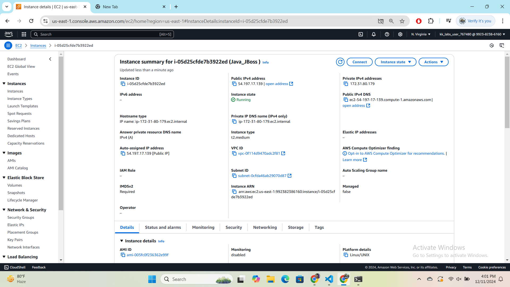

  
## Setting Up Your EC2 Instance

Create an EC2 Instance:

Log in to the AWS Console.
Launch a new EC2 instance (preferably Ubuntu or Amazon Linux 2).
Choose the appropriate instance type.
Create and assign a security group allowing SSH (port 22) and HTTP/HTTPS (ports 80/443).
Download the .pem key pair for SSH access.

## Connect to the EC2 Instance:

 ssh -i "JBoss.pem" ubuntu@ec2-3-83-224-173.compute-1.amazonaws.com

 Step 1: Update Package List
Before installing any package, update the package list to ensure you have the latest repository information:

    sudo apt update

