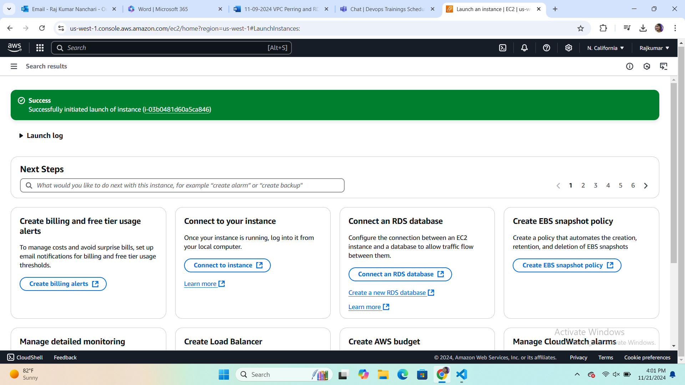
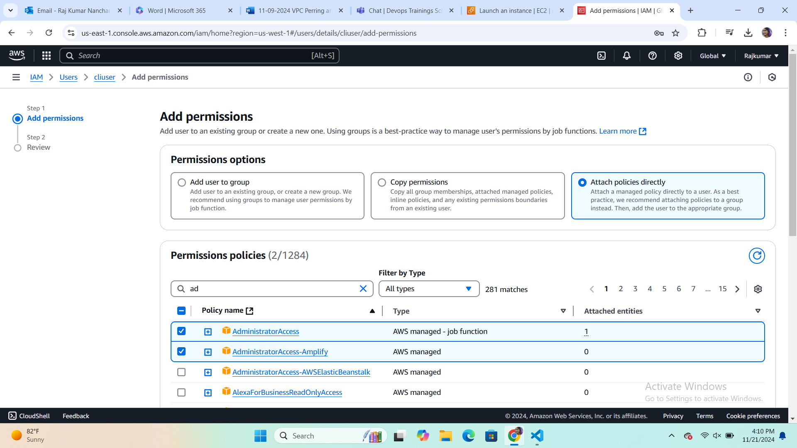
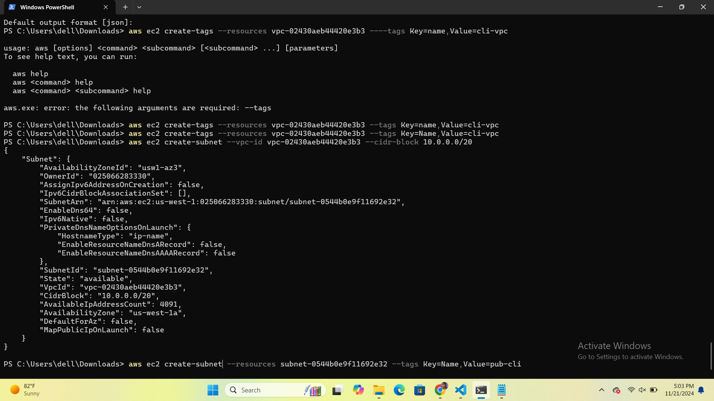
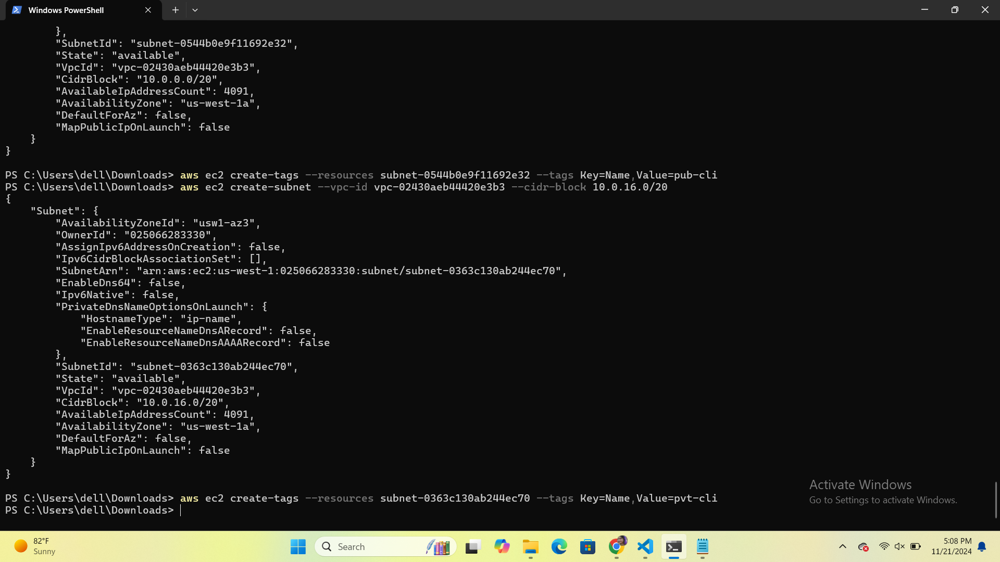

- Create VPC using cli
     vpc-07da4b500f9a95ce4   

   
- create Pub and Pvt subnets
      pub==> subnet-04dc907c1e5ba327e
       pvt==>subnet-040773d6373797026
       
- create IGW
      igw-0eca198106314387e

- Attach IGW to VPC
    aws ec2 attach-internet-gateway --internet-gateway-id igw-0eca198106314387e --vpc-id vpc-07da4b500f9a95ce4

- Create Pub and PVT RT
              vpc-07da4b500f9a95ce4
        
- Attach Pub sub to Pub rt
     rtb-03ad8697d2ad9a1f3

- Attach Pvt Sub to Pvt rt

- Attach IGW to Pub RT

- Create Sg for ssh // http
sg-01c23eec36f8fda03
Allow Http Access Port 22

aws ec2 authorize-security-group-ingress --group-id sg-01c23eec36f8fda03 --protocol tcp --port 22 --cidr 0.0.0.0/0

Allow Http Access Port 80
 aws ec2 authorize-security-group-ingress --group-id sg-01c23eec36f8fda03 --protocol tcp --port 80 --cidr 0.0.0.0/0

- Create a Ec2 in Pub Sub
aws ec2 run-instances --image-id ami-0dee22c13ea7a9a67  --instance-type t2.micro --key-name demo --subnet-id subnet-04dc907c1e5ba327e --security-group-ids sg-01c23eec36f8fda03

Ec2 Name Creation >aws ec2 create-tags --resources i-075b054106cc52520 --tags Key=Name,Value=MyC2Instance 
- Create a Ec2 in Pvt Sub 

- Create a Ec2 in Pvt Sub 
>aws ec2 run-instances --image-id ami-0dee22c13ea7a9a67  --instance-type t2.micro --key-name demo --subnet-id subnet-040773d637379702
6 --security-group-ids sg-01c23eec36f8fda03
