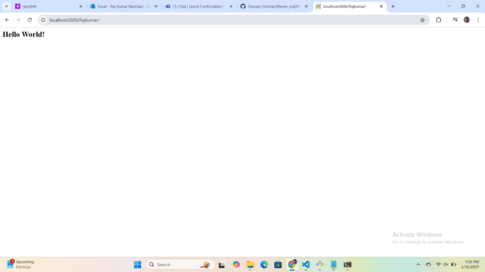
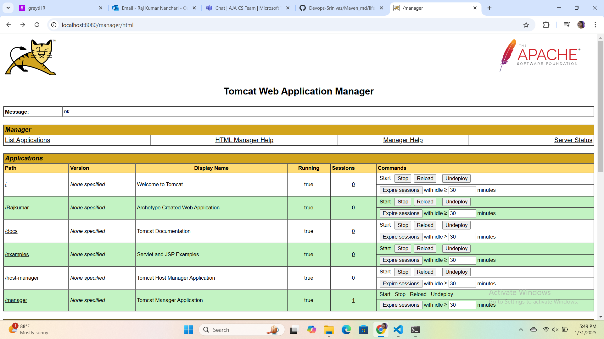
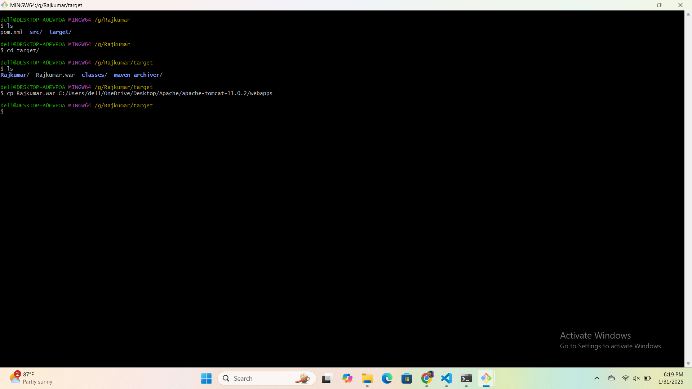
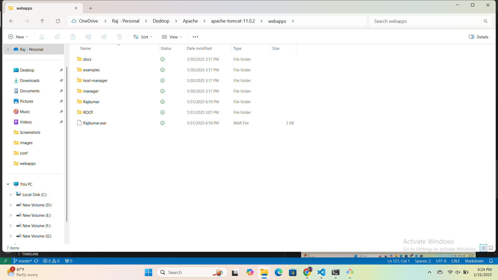

## Apache Tomcat

  Apache TomCat is open source web server and servlet container for java code.

### How To install Apache Tomcat on windows:

  ### what is Apache Tomcat

    Apache tomcat is an open-source web server and servlect container of java code.

    Prerequisites:
    .java jRE installed and configured 
    .Administrator privilege

   #### How to install apache tomcat on windows
     Step1: Download TomCat for windows
      Browse to the official apache TomCat Website

  step2:install tomcat 

  install tomcat via the windows service installer for an automated and wizared epernice.
  .exe is directly download no need to zip here.

  After download zip file, depending on your windows  version ,unzip download file ,Right click the file 
  and select Extract all.

  .Default port number of apache tomcat is 8080.
  .If at all we want change defalut port number goto 
  apache >conf/>then server.xml file we need figure out
  this
       <connect port ="8080" portocal ="HTTP/1.1"
       connectionTimeout ="20000"
       redirectPort ="8443">

## How to start and stop Apache Tomcat
### start
Apache tomcat>Bin>set up(windows Batch file)

### stop 
Apache Tomcat > bin >shutdown

### For configuration changes:
    Apache Tomcat ---> Conf

 ### For hosting Of Application (Artificate/Deployble package)
        Apache tomcat --->webapps

   ### For log        
   Apache tomcat --->logs(Apache Tomcat and also application which is running inside Tomcat)

   we can access Apache Tomcat localhost:8080 or 
   127.0.0.1:8080

 ### Floder srtucture of Apache tomcat

 conf-configuration
bin-binary (to start and stop the server)
webapps-hosting the application
logs-server logs
lib-libraries
temp-temporary files

 ### How to Access Application URL
    [127.0.0.1 or localhost:8080] means
    <URL of Format>/Artifact>
    eg:8080/aja ==> here aja is ArtifactName

  To Generate project command
### to create project in maven:
      mvn archetype:generate -DgroupId=com.example.Rajkumar -DartifactId=Rajkumar -DarchetypeArtifactId=maven-archetype-webapp -DinteractiveMode=false

### how we can place the Artifact from mvn project of the Target floder to
    
  cp<path where Artifact><path where app soft tomcat>
            <or>

    cp <source code> <destionation>
          <and>

     <destionation> cp / <source>

   Default to some other port 
   .if you do any conf changes restart the server in our case
    apache tomcat  

### If we do any configuration changes we need to restart the server
    To change the port number of Apache tomcat. we should stop the tomcat
   then change the default port we to other port number then we can start

  ### To deploy the application anotherway is by using the tomcat gui
   Access the url of tomcat then search for the .war file to deploy
    click on choose file it will open dialogbox in dialogbox we need to select the artifact and click on open then we need to click on deploy button

   ### how can we access apache tomcat GUI go to tomcat home folder
    home folder of apache tomcat -->conf
    modify "tomcat-user.xml"(using text editor eg:vi)
    vi tomcat-user.xml (we need to search for the line)<user username="admin" 
    need to uncomment these lines -- "<!--" "-->"
    once we modify tomcat-user.xml file save and quit

  ### what is the difference between pom.xml and settings.xml
     Use pom.xml to define dependencies, plugins, and configurations specific to a project.
     Use settings.xml to configure Maven behavior globally, such as repository authentication and proxy settings.

    to view the last n number of lines where n is a number: tail -15 filename

    to view the first n number of lines where n is a number: head -2 filename

     

