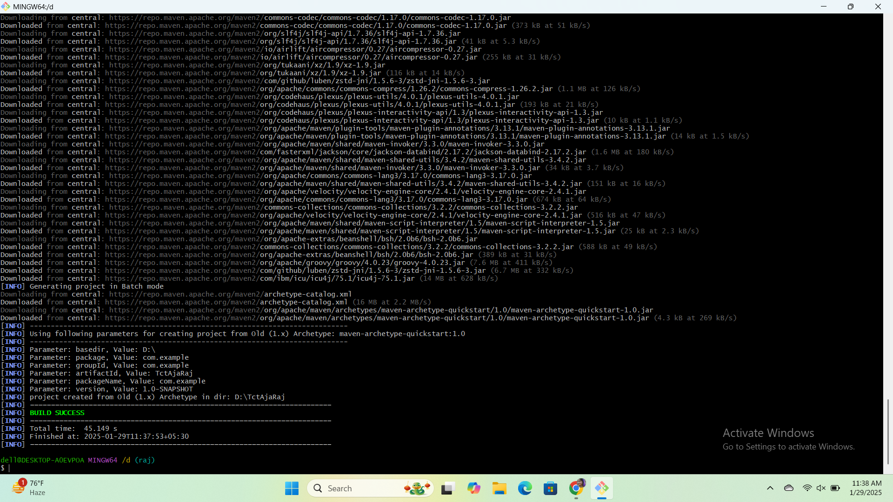
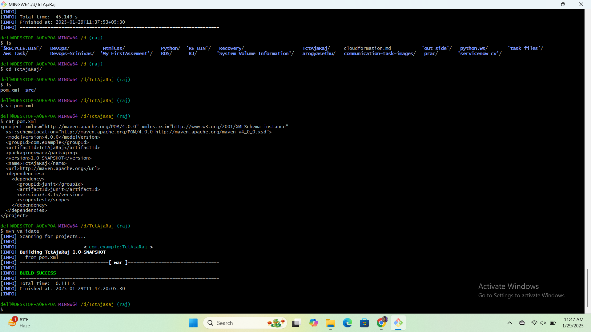
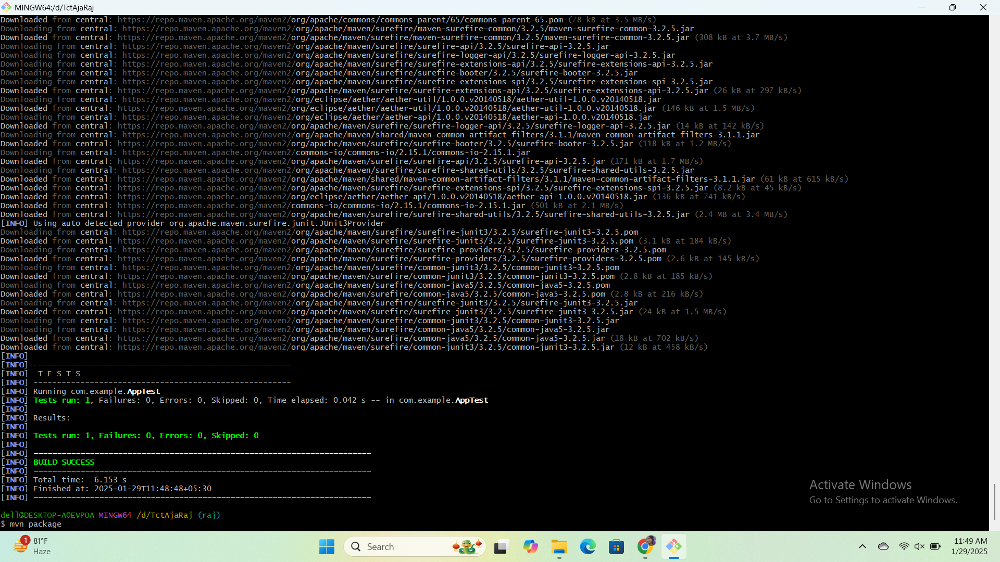
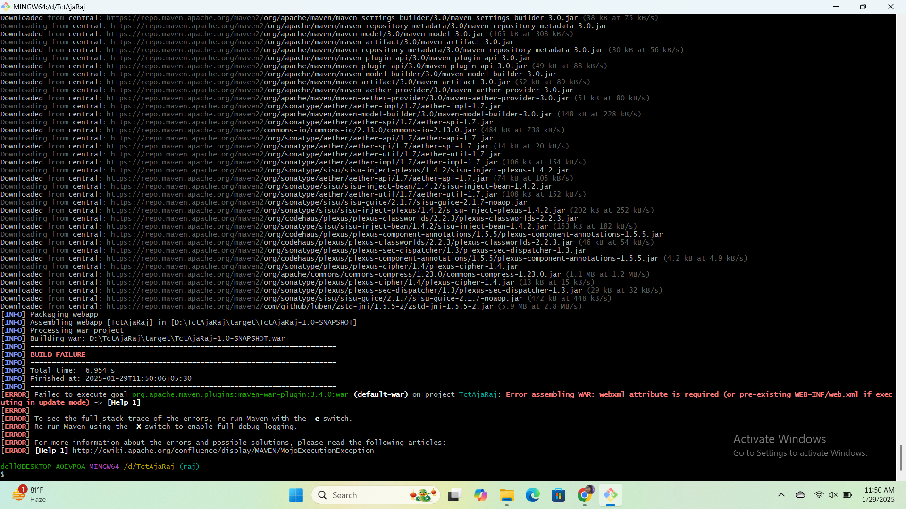
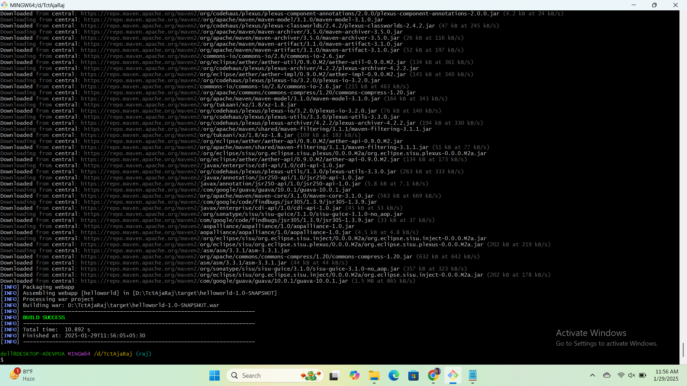
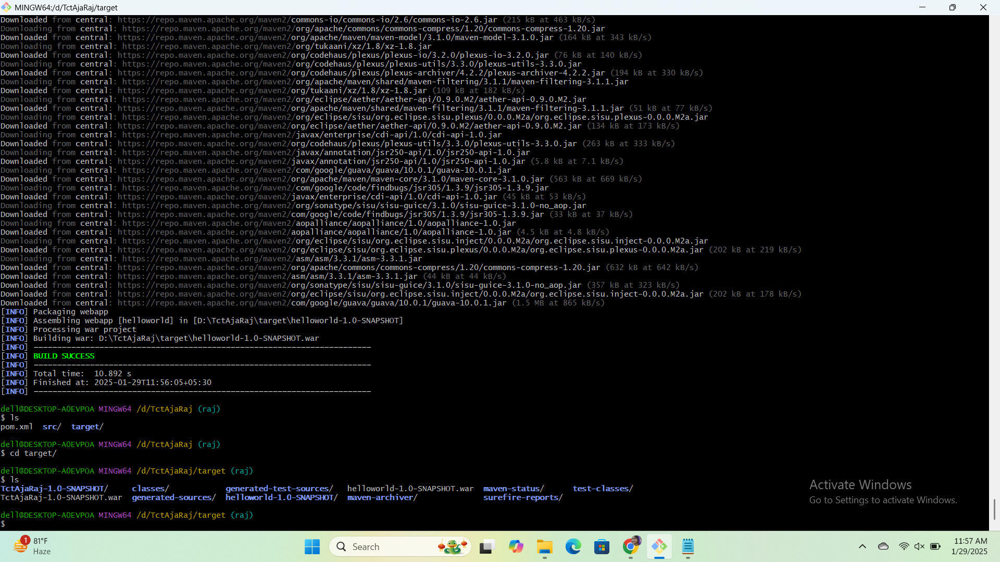
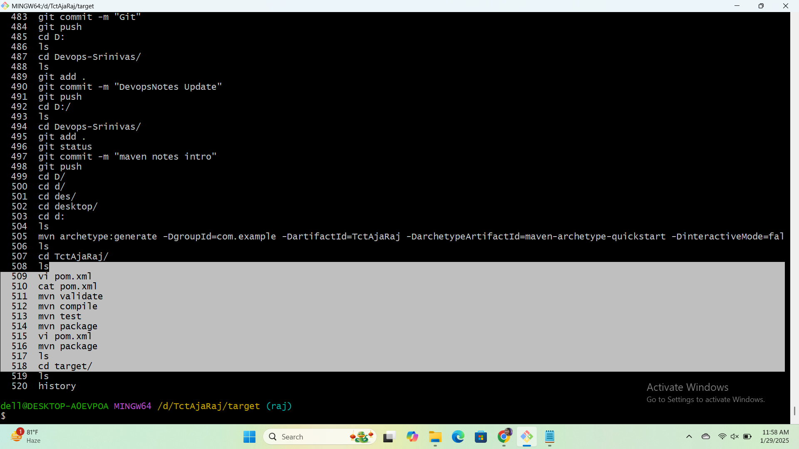

### Maven Through Terminal
	•Install the Maven tar file after verify the signature 
	•After installing the Maven, Check its version from UBANTU terminal by using the below command 
                $mvn -version 
	•The purpose of the command is to run the project 

### Maven life-cycle phase 
	• mvn -version 
	• mvn validate
	• mvn compile 
	• mvn test 
	• mvn package 
	• mvn integration-test
	• mvn verify 
	• mvn install
	• mvn deploy 
	
 
	• Validate: Check if the project is correct, having all the necessary information 
          $mvn validate 
	• Compile: It compiles the source code of the project 
          $mvn compile 
	• test: test the compiled source code using a suitable unit testing framework -these tests should not required the code to be packaged or deployed 
          mvn test 
	• Package: task the compiled code and package it in its distributable format, such as a JAR 
          mvn package 
	• Integration-test: process and deploy the package into an environment where integration test can be run 
          mvn integration-test 
	• Verify: run any checks to verify the package is valid and meets quality criteria 
          mvn verify 
	• Install: install the package into the local repo for use as a dependency in other projects locally 
          mvn install
	• Deploy: done in an integration or release environment copies the final packages to the remote repositories for sharing with other developer and projects 
          mvn deploy 

###  What is .m2 folder ? 
     .For sharing with other developers and project .m2 folder
      .m2 folder is a folder in a local repositories and apache maven where dependency and plugin is stored 

### Apache Maven has a advantage 
    . apache maven has a advantage that is when we run any of the life-cycle phase which is also includes previous life cycle phase as well 
    E.g: If we run "mvn package" (which is 4th phase) we should also run previous phase as well (validate, compile, test)
    
	 you can run mvn validate with in project only 

###	  working Maven Artifacat generate 
	 .After install maven and java open git bash cd to one drive like [cd D:]
	 .Next paste the link this 
	 [mvn archetype:generate -DgroupId=com.example -DartifactId=helloworld -DarchetypeArtifactId=maven-archetype-quickstart -DinteractiveMode=false ]
	.Enter Next ls it will show pom.xml and src file
	.Here cd to pom.xml change jar to war  save
	.Do Mvn validate
	.Do mvn Compile
	.Do mvn test
	.vi pom.xml 
	https://ajaconsultingservicesllp-my.sharepoint.com/:t:/g/personal/s_chunchu_ajacs_in/EZuE9nEpo05LuePhLOwgKtUB6CzC6DRL2ZaH_z6kPUulQQ?e=bJcJY9  copy plugin paste here 
	

	.Do mvn package 
	Build success here and generate target floder
	enter ls see here .war Artifact

	
	
	